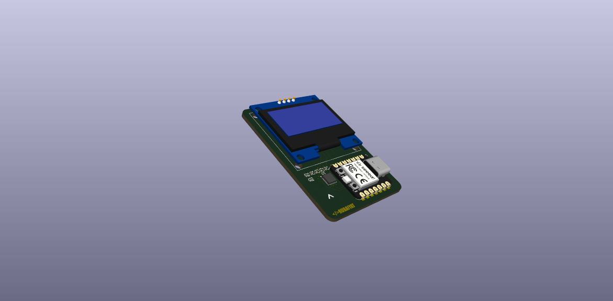
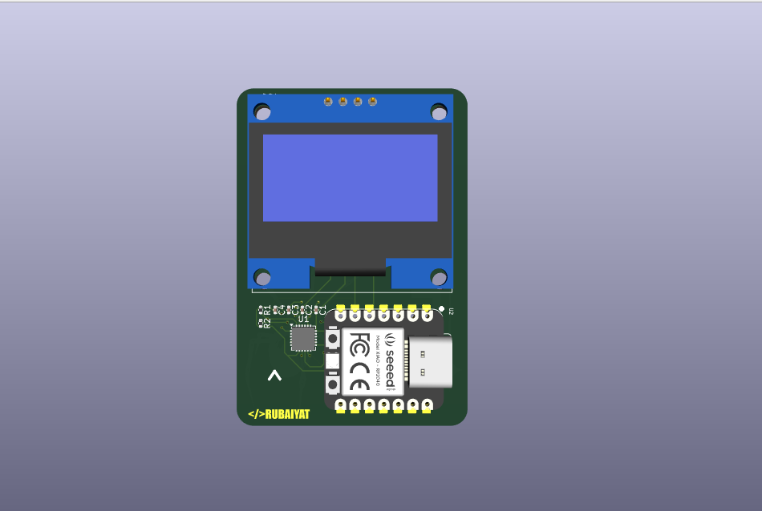
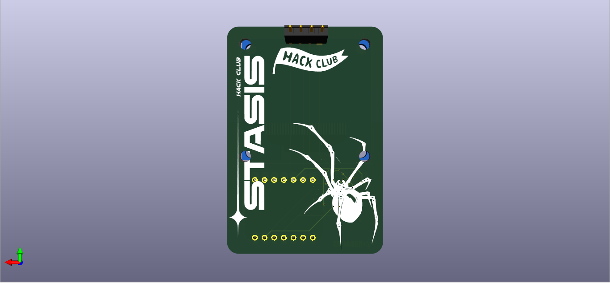
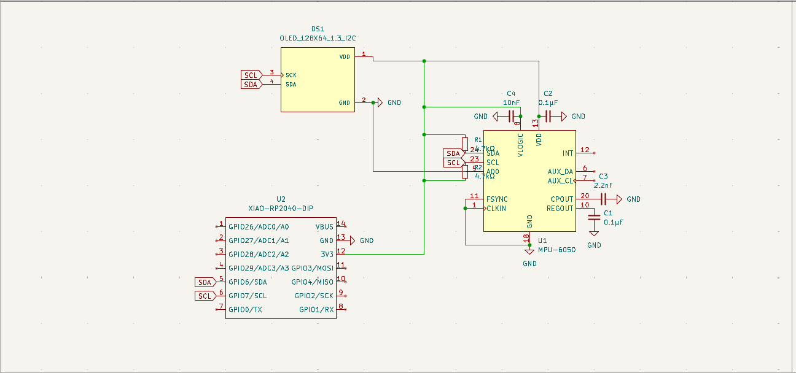
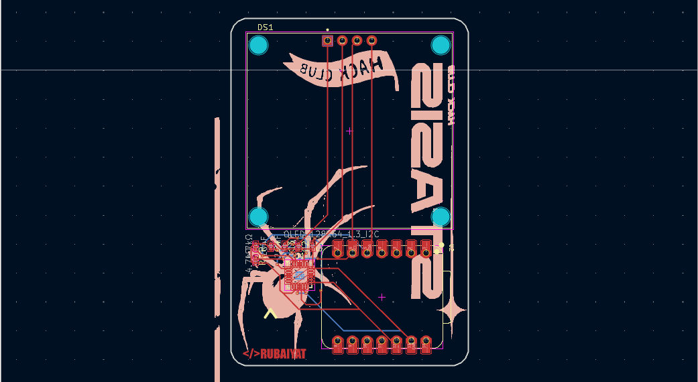

# Hermes-3-Axis-accelerometer

Hermes is a 3-Axis accelerometer that uses an embeded mpu6050 for controlling and gyro sensing. It has a Xiao RP2040 as a micro controller for it's compact size and versatile use.Designed for real-time motion data visualization in a small, badge-friendly form factor. It's intended use could be in a bicycle or any other device that's position and gyro data needs to be mesured.This is made in kicad and the files needed can be found in this directory. 

## Features

- **MPU-6050 IMU** — 6-axis accelerometer + gyroscope over I2C for
  real-time motion and orientation tracking
- **1.28" I2C OLED Display** — 128×64 pixel screen for live data
  readout or custom graphics
- **Seeed XIAO RP2040** — powerful dual-core microcontroller with
  USB-C, onboard RGB LED, and a tiny footprint
- **Decoupling & Filtering** — on-board bypass capacitors (0.1µF,
  10nF, 2.2nF) for clean, stable power to both ICs
- **Compact PCB Design** — rounded corners, mounting holes, and a
  clean layout with all components on a single board
- **USB-C Powered** — program and power the board directly via the
  XIAO's USB-C port

## BOM

| Name | Purpose | Qty | Total Cost (USD) | Distributor | Link |
|------|---------|-----|-----------------|-------------|------|
| PCB | The board | 5 | $30.00 | JLCPCB | [link](https://jlcpcb.com) |
| 4.7kΩ Resistor | I2C Pull-up | 2 | $1.00 | Digikey | [link](https://www.digikey.com/en/products/detail/susumu/RG2012L-472-L-T05/3738065) |
| 10nF Capacitor | Voltage stabilization | 1 | $1.00 | Digikey | [link](https://www.digikey.com/en/products/detail/kemet/C0402C103K5RECAUTO/8646477) |
| 2.2nF Capacitor | Voltage stabilization | 1 | $1.00 | Digikey | [link](https://www.digikey.com/en/products/detail/kemet/C0402C222F3GECTU/8644380) |
| 0.1µF Capacitor | Voltage stabilization | 2 | $3.00 | Digikey | [link](https://www.digikey.com/en/products/detail/samsung-electro-mechanics/CL05B104KP5NNNC/3886660) |
| 1.3" OLED Display | Output display | 1 | $5.00 | Daraz | [link](https://www.aliexpress.com/item/1005004131362533.html?spm=a2g0o.cart.0.0.7d0b38daOzt1YF&mp=1&pdp_npi=6%40dis%21USD%21USD%203.19%21USD%202.39%21%21USD%202.39%21%21%21%402101246417804712022741622eec63%2112000028137900082%21ct%21BD%217350065947%21%211%210%21&pdp_ext_f=%7B%22cart2PdpParams%22%3A%7B%22pdpBusinessMode%22%3A%22retail%22%7D%7D) |
| Seeed XIAO RP2040 | MCU | 1 | $11.00 | Daraz | [link](https://www.aliexpress.com/item/1005009606027401.html?spm=a2g0o.cart.0.0.ff2038dandQAX1&mp=1&pdp_npi=6%40dis%21USD%21USD+8.00%21USD+8.00%21%21USD+8.00%21%21%21%402101246417804709802308374eec63%2112000049609674780%21ct%21BD%217350065947%21%211%210%21) |
| MPU-6050 | Accelerometer/Gyroscope | 1 | $14.90 | TDK InvenSense | [link](https://jlcpcb.com/partdetail/TDKInvenSense-MPU6050/C24112) |

**Total Estimated Cost: $66.90**

Made by  </>RUBAIYAT
